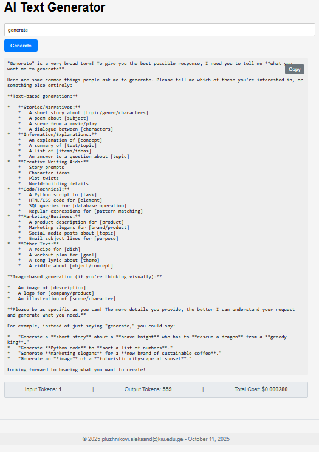

# AI Text Generator - Homework 1

## Author
[Aleksandre Pluzhnikovi] - [Pluzhnikovi.aleksand@kiu.edu.ge]

## Final Product Screenshot

## Features Implemented
### 1. Streaming Text Display
* **Description:** I updated my `generateText` function to use the `:streamGenerateContent` endpoint. My code now processes the response as a stream of text chunks and appends them to the output area in real-time.
### 2. Detailed Cost Display
* **Description:** After the stream is complete, I parse the `usageMetadata` from the final API chunk. I then update the DOM to display the input tokens, output tokens, and the total calculated cost.
### 3. Copy to Clipboard Button
* **Description:** I added a "Copy" button. An event listener on this button uses the `navigator.clipboard.writeText()` method to copy the content of the output area. The button text temporarily changes to "Copied!" for confirmation.
### 4. Personalized Footer
* **Description:** I added a footer to the `index.html` file. I then wrote a JavaScript function that runs when the page loads to dynamically insert my email address and the current date using `new Date()`.

## How to Run This Project
1. Clone this repository.
2. Add your Gemini API key to `script.js` in the `API_KEY` variable.
3. Run a local server (e.g., `python3 -m http.server 8000`).
4. Open `http://localhost:8000` in your browser.